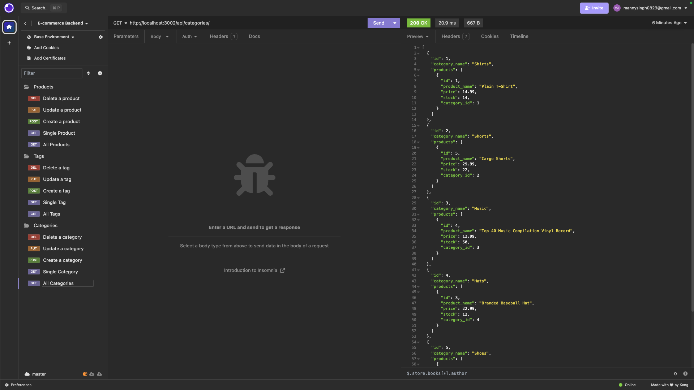

# E-commerce Backend

## Description

This is the backend system for an e-commerce website. It's powered by an Express.js API and uses Sequelize as the ORM tool to interact with a MySQL database.

## License

This application is covered under the MIT License.

## How To Contribute

N/A

## Tests

N/A

## Video Link

https://drive.google.com/file/d/1-DjQs9Em1ddHG2ksVarRx-iGeW6nJ6Ze/view

## Questions

For any questions or inquiries, please reach out via GitHub or email:

GitHub Profile: [mandeepiscoding](https://github.com/mandeepiscoding)
Email: [mannysingh0829@gmail.com](mailto:mannysingh0829@gmail.com)

## Copyright

&copy; 2024 Mandeep Singh. All rights reserved.

